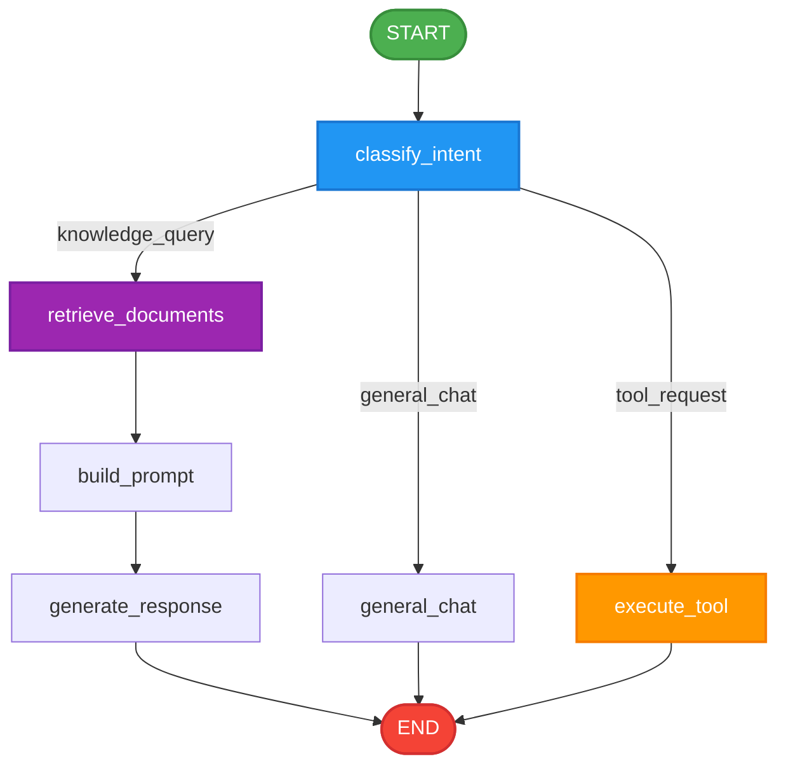

# Enterprise Knowledge Platform (EKP)

A comprehensive, retrieval-augmented knowledge platform (RAG) designed for enterprise document search, question answering, and automated tool orchestration. The platform integrates a FastAPI backend with a LangGraph-based workflow engine and a Streamlit frontend UI.

---

## 🏗️ Architecture Overview

The core query orchestration is powered by **LangGraph**, routing queries based on intent classification to the appropriate processing path.

### LangGraph Workflow



### Component Architecture

```
                                  +-----------------------+
                                  |   Streamlit Frontend  |
                                  |     (Port 8501)       |
                                  +-----------+-----------+
                                              | HTTP
                                              v
                                  +-----------------------+
                                  |    FastAPI Backend    |
                                  |     (Port 8000)       |
                                  +-----------+-----------+
                                              |
                                              v
                                  +-----------------------+
                                  |  LangGraph Controller |
                                  +-----------+-----------+
                                              |
                       +----------------------+----------------------+
                       |                      |                      |
                       v                      v                      v
             [ Intent Classifier ]     [ RAG Pipeline ]       [ Tool Registry ]
             Uses ChatGroq to route    ChromaDB & HuggingFace  Orchestrates Ticket,
             user messages             Embeddings (Sentence-   Leave & OAuth-based
                                       Transformers)           Gmail services
```

---

## 📂 Repository Layout

```
├── app/                           # Backend Application
│   ├── api/                       # FastAPI router, endpoints & dependencies
│   │   ├── routes/                # Endpoint groups: chat, docs, health, tools, retrieve
│   │   └── app.py                 # FastAPI application root configuration
│   ├── config/                    # Configuration settings & logging initializers
│   │   ├── settings.py            # Pydantic-based configuration (from .env)
│   │   └── logging.py             # Global logging formatter setup
│   ├── graph/                     # LangGraph workflow components
│   │   ├── builder.py             # Injects services and compiles the graph
│   │   ├── workflow.py            # StateGraph transition logic & conditional edges
│   │   ├── nodes.py               # Node methods (classify, retrieve, generate, etc.)
│   │   └── state.py               # TypedDict defining the shared GraphState
│   ├── services/                  # Business Logic layer
│   │   ├── chat_service.py        # Graph invocation wrapper
│   │   ├── document_service.py    # Document ingestion coordinator
│   │   ├── document_indexer.py    # Pipeline for PDF loading, splitting & embedding
│   │   ├── intent_service.py      # LLM classification logic
│   │   ├── llm_service.py         # ChatGroq API handler (supports structured outputs)
│   │   ├── embedding_service.py   # HuggingFace sentence-transformers initialization
│   │   └── tool_service.py        # Router deciding which tool to call
│   ├── tools/                     # System tools definitions
│   │   ├── base.py                # Abstract BaseTool class
│   │   ├── tool_registry.py       # Instantiates and maps tools to keys
│   │   ├── email_tool.py          # Extracts parameters using LLM and sends via Gmail
│   │   ├── ticket_tool.py         # Mock ticket creation tool
│   │   └── leave_tool.py          # Mock leave application tool
│   ├── integrations/              # Third-party integrations
│   │   └── gmail/                 # Gmail OAuth and Send client
│   └── models/                    # Pydantic Request/Response validation schemas
│
├── frontend/                      # Streamlit Frontend Client
│   ├── api/                       # HTTP API Client wrappers using httpx
│   ├── components/                # Modular Streamlit elements (chat, sidebar, status)
│   ├── models/                    # Client-side validation schemas
│   ├── services/                  # Frontend services (handling upload, health checks)
│   └── app.py                     # Streamlit entry point
│
├── data/                          # Vector store and raw file storage (created on run)
│   ├── chroma/                    # ChromaDB persistent collections
│   └── raw/                       # Cached raw PDFs uploaded by users
│
├── credentials/                   # OAuth API Credentials
│   ├── gmail_client_secret.json   # Google Cloud OAuth client credentials
│   └── token.json                 # Generated OAuth token (automatically created)
│
├── tests/                         # Test Suite
│   ├── graph/                     # Graph builds and transition tests
│   ├── services/                  # Intent classification unit tests
│   └── manual/                    # Scripts for manual API, OAuth, and email validation
```

---

## 🔧 Environment Configuration

To configure the platform, copy or create a `.env` file in the root directory.

| Variable | Description | Default / Example |
|---|---|---|
| `APP_NAME` | Title of the application | `Enterprise Knowledge Platform` |
| `APP_ENV` | Environment level | `development` |
| `GROQ_API_KEY` | API Key for Groq Cloud (LLM generation) | *Required* |
| `LLM_MODEL` | LLM Model name on Groq | `llama-3.3-70b-versatile` |
| `EMBEDDING_MODEL` | Hugging Face embedding model | `sentence-transformers/all-MiniLM-L6-v2` |
| `CHROMA_DB_PATH` | Storage directory for vector database | `data/chroma` |
| `CHROMA_COLLECTION_NAME` | Chroma database collection name | `enterprise_documents` |
| `BACKEND_URL` | Base API URL for frontend components | `http://localhost:8000/api/v1` |

---

## 📬 Integration: Gmail OAuth Setup

The `EmailTool` uses **OAuth 2.0** to send real emails via the Gmail API. To enable this:

1. Create a project in the **Google Cloud Console**.
2. Enable the **Gmail API**.
3. Configure the OAuth Consent Screen and add the scope `https://www.googleapis.com/auth/gmail.send`.
4. Create an **OAuth 2.0 Client ID** (Application Type: *Desktop Application*).
5. Download the JSON credentials file and save it to `credentials/gmail_client_secret.json`.
6. On the first run, calling the email tool will trigger a local browser authentication prompt. Once authenticated, a `credentials/token.json` file is saved for subsequent runs.

---

## 🚀 Getting Started

### Local Development

1. **Install Python 3.12+** and **uv** (recommended package manager).
2. Install the repository in editable mode along with its dependencies:
   ```bash
   uv pip install -e .
   ```
3. Set up your `.env` file with the required credentials.
4. Run the backend server:
   ```bash
   uvicorn app.api.app:app --reload
   ```
5. In a separate terminal session, run the frontend client:
   ```bash
   streamlit run frontend/app.py
   ```
6. Open your browser to the local Streamlit application (usually `http://localhost:8501`). Access backend Swagger docs at `http://localhost:8000/docs`.

### Docker Compose

You can build and launch both services together using Docker:
```bash
docker-compose up --build
```
* Note: Ensure your `.env` contains valid credentials. If running the Gmail OAuth flow for the first time inside Docker, ensure credentials/token.json is already generated locally, as the desktop oauth redirect flow cannot easily run inside headless container environments.

---

## 🧪 Testing

The test suite contains both automated unit tests and manual verification scripts.

### Running Unit Tests
```bash
pytest
```
*Note: Make sure your `GROQ_API_KEY` is loaded in the terminal session, as intent classification and graph routing tests will perform live LLM requests.*

### Running Manual Scripts
Manual scripts are present under `tests/manual/` and can be run directly:
```bash
# Test structured email extraction output
python tests/manual/test_structured_output.py

# Test Gmail OAuth flow initialization
python tests/manual/test_gmail_auth.py

# Test sending a mock email using current credentials
python tests/manual/test_send_email.py
```
